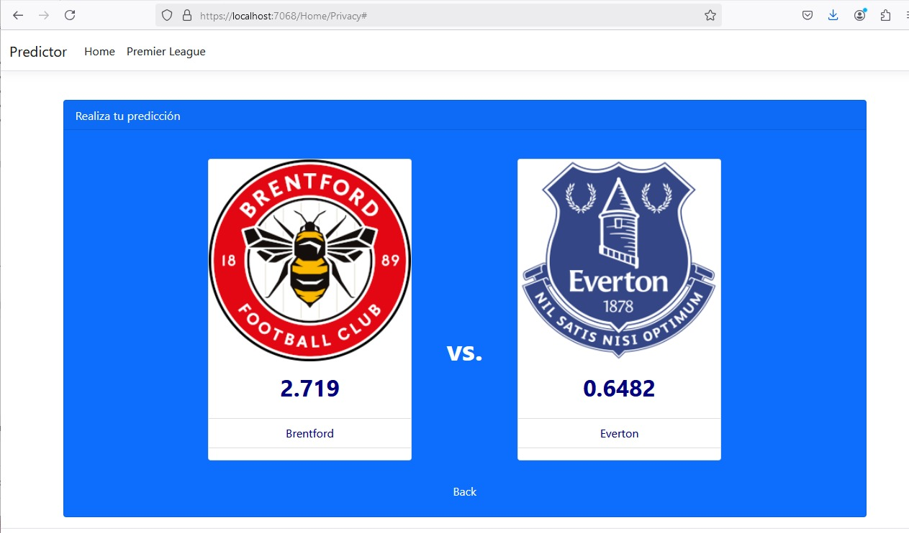

# README: Predicción de Goles en Partidos de Fútbol con un Modelo MLP

## REDES NEURONALES

Este proyecto implementa un modelo de red neuronal multicapa (MLP) para predecir los goles de los equipos local y visitante en partidos de fútbol. Utiliza datos históricos obtenidos de [football-data.co.uk](https://www.football-data.co.uk/) y características como el estado de forma reciente de los equipos para realizar predicciones.



---

## Tabla de Contenidos

1. [Descripción del Proyecto](#descripción-del-proyecto)
2. [Requisitos](#requisitos)
3. [Estructura del Código](#estructura-del-código)
4. [Cómo Usar el Proyecto](#cómo-usar-el-proyecto)
5. [Entrenamiento del Modelo](#entrenamiento-del-modelo)
6. [Visualización de Métricas](#visualización-de-métricas)
7. [Predicción de Goles](#predicción-de-goles)
8. [Referencias](#referencias)

---

## Descripción del Proyecto

El objetivo de este proyecto es construir un modelo que prediga el número de goles anotados por dos equipos (local y visitante) en un partido. El modelo utiliza como entrada las siguientes características:

- **HF (Home Form):** Rendimiento promedio del equipo local en los últimos 5 partidos.
- **AF (Away Form):** Rendimiento promedio del equipo visitante en los últimos 5 partidos.
- **HomeTeam:** Equipo local.
- **AwayTeam:** Equipo visitante.

El modelo es entrenado con datos históricos de varias temporadas de la Premier League.

---

## Requisitos

Para ejecutar este proyecto, necesitas tener instalados los siguientes paquetes:

- Python 3.8 o superior
- Pandas
- NumPy
- scikit-learn
- TensorFlow
- Matplotlib

Instala los requisitos usando:

```bash
pip install pandas numpy scikit-learn tensorflow matplotlib
```

---

## Estructura del Código

1. **Carga de Datos:** Descarga y combina datos históricos de múltiples temporadas.
2. **Preprocesamiento:**
   - Ingeniería de características: Se calcula el estado de forma reciente de los equipos.
   - Transformaciones: Estandarización y codificación one-hot de las características.

3. **Definición del Modelo:** Red neuronal con tres capas ocultas, optimizada para regresión.
4. **Entrenamiento:** Entrena el modelo con los datos preprocesados y divide en conjuntos de entrenamiento y validación.
5. __Evaluación:__ Calcula métricas como `loss` y `mean_squared_error` en los datos de prueba.
6. **Predicción:** Realiza predicciones para un partido específico.

---

## Cómo Usar el Proyecto

### 1. Ejecutar el Pipeline Completo

Ejecuta el script `main` para cargar los datos, entrenar el modelo y realizar una predicción de ejemplo:

```bash
python script.py
```

### 2. Modificar Equipos para Predicción

En la función `main`, cambia los valores de `home_team` y `away_team` para predecir un partido específico:

```python
home_team = 'Man City'
away_team = 'Liverpool'
```

---

## Entrenamiento del Modelo

Durante el entrenamiento, el modelo utiliza 50 épocas y un conjunto de validación del 10%. El historial de entrenamiento guarda las métricas como `loss`, `val_loss`, `mse` y `val_mse`.

### Hiperparámetros del Modelo

- Capas ocultas: 3
- Unidades por capa: 128, 64, 32
- Función de activación: ReLU
- Optimizador: Adam
- Tasa de aprendizaje: 0.001
- Pérdida: Mean Squared Error

---

## Visualización de Métricas

Para evaluar el rendimiento del modelo, se genera un gráfico de las métricas de entrenamiento y validación. Usa el siguiente código después del entrenamiento:

```python
plot_training_metrics(history)
```

El gráfico muestra:

- **Training Loss:** Pérdida durante el entrenamiento.
- **Validation Loss:** Pérdida en el conjunto de validación.
- **Training MSE:** Error cuadrático medio en el entrenamiento.
- **Validation MSE:** Error cuadrático medio en la validación.

---

## Predicción de Goles

El modelo permite predecir los goles de un equipo local y visitante. Usa la función `predict_score` para realizar predicciones:

```python
predicted_scores = predict_score(preprocessor, model, 'Man City', 'Liverpool')
print(f"Predicted score - Man City: {predicted_scores[0]:.2f}, Liverpool: {predicted_scores[1]:.2f}")
```

### Ejemplo de Salida

```ini
Predicted score - Man City: 2.13, Liverpool: 1.47
```

---

## Referencias

1. Datos históricos de fútbol: [football-data.co.uk](https://www.football-data.co.uk/)
2. Documentación de TensorFlow: [tensorflow.org](https://www.tensorflow.org/)
3. Guía de scikit-learn: [scikit-learn.org](https://scikit-learn.org/)
4. Matplotlib para visualización: [matplotlib.org](https://matplotlib.org/)

---

Con esta guía, puedes usar y extender este proyecto para realizar predicciones más avanzadas en el contexto de análisis de partidos de fútbol. 🎯
